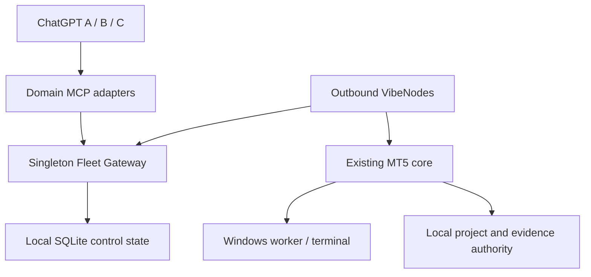

# Fleet v1 — Proposed Blueprint

Version: 1.0. Date: 2026-10-01. **Approved at original revision 063d6a3**, per the [owner approval record](approval-2026-10-02.md); implementation/capability gates remain active.

After Q1's scoped Windows fixture PASS, the owner approved the [TIP-057R boundary amendment](TIP-057R-boundary-amendment.md) at **2026-10-02T21:21:49+07:00**, binding PR #61 head `0ee42c9`. The addition authorizes G03-A common product ownership/admission source/tests and specifies a future installation protocol. Actual migration/activation and Q2 environment gates remain distinct; the original fleet delivery order remains unchanged.

## 1. Product outcome and delivery scope

ChatGPT can identify and inspect the correct registered VPS/MT5 through one domain tool surface. Later it can run a bounded native job on an immutable target and retrieve verifiable evidence. The system must preserve existing checkpoint/CAS, guarded iteration, Continuity and exact process ownership rather than replace them with generic developer abstractions.

| Milestone | Deliverable | Capability boundary |
|---|---|---|
| M0 | Durable local device/terminal identity and target vocabulary | Inventory enrichment only; fixed MT5-2 native behavior retained |
| M1 | Two-node read fleet with minimal partial snapshot | IPC serialized per node; native jobs and source mutation remain on the existing local path |
| M2 | Target-aware project/iteration plus local native pinning | Dedicated tester targets; one native job per node; repo/executor co-located |
| M3 | Durable remote native job proxy | Global/node job binding, reconciliation and exact cancellation; same-node inputs |
| M4 | Qualified terminal-scoped native concurrency | Independent resources and reserved device capacity |
| M5 | Multi-agent source isolation | Git worktrees and authenticated ownership; no generic worker in this release |
| Release | Fault/recovery and scope-bound qualification | Only tested capability, load and physical topology are certified |

Deferred: generic Repo Worker, pool scheduling, remote repository-input transfer, automatic FX conversion and non-Git path leases. They need demonstrated demand and separate approved scope; deferred requirements remain visible in the ledger.

## 2. Architecture and process boundary



One catalog means one domain API, not one MCP process shared magically between accounts. Existing A/B/C stdio adapters can remain separate clients of **one persistent gateway service**. They must not each spawn a gateway, scheduling loop or SQLite writer authority. A startup/health check detects an existing gateway and fails safely on duplicate ownership. Nodes poll/heartbeat/commit results over a reachable HTTPS service endpoint; the existing stdio tunnel alone is not a node ingress endpoint.

Gateway placement on the current VPS is acceptable for a small pilot if measured resource usage and shared failure domain are accepted. Its actual endpoint, TLS termination/provider and provisioning are chosen before TIP-058 deployment. No speculative provider installation occurs in M0. No node requires an inbound public port.

| Authority | Owns | Does not attest |
|---|---|---|
| Gateway | Enrollment, routing generations, registry, command/global-job routes, read model | Native process completion based on cached registry alone |
| VibeNode | Actual files, runtime/session readiness, native dispatch/process identity and immutable artifacts | Another node's physical execution |
| Project owner node | Project Session/Iteration/Continuity writer and source CAS | A mutable central duplicate of project history |
| MCP adapter | Domain request validation and authenticated client/owner context | A security-grade ChatGPT account ID not exposed by the transport |

MVP uses one project writer on its owner node. Gateway stores route/read references rather than a second writable project-session store. Project source and executor are co-located until input transfer has an approved bundle protocol.

## 3. M0 identity contract

Use opaque persisted IDs, not IDs recomputed from hostname, alias, build or current path. A record can use `dev_<uuid>` / `term_<uuid>`; the exact UUID library format is an implementation choice if round-trip and validation contracts remain stable.

Proposed local authority: `state/fleet/identity.json`, schema `fleet.identity/1`, plus a cross-process enrollment/update lock. Use one atomic replacement and the existing atomic-write/locking pattern. M0 uses this small local registry; SQLite is for the gateway in M1, not an extra M0 service dependency.

Fields: schema version, device ID, identity revision, terminal records with terminal ID, alias, normalized executable/data-root binding, terminal generation, enabled state and labels. Cryptographic node key/enrollment arrives in TIP-058; an M0 device ID is **not an authenticated fleet enrollment**. M0 output labels its authority `LOCAL_PERSISTED_REGISTRY`.

Generations/revisions start at 1 and are positive integers, not booleans. IDs are unique within their scope; terminal aliases are compared using the existing case-insensitive convention. Unsupported schema versions, duplicate IDs and malformed bindings are invalid. Bootstrap validates the full proposed registration before one all-or-none commit. Updates require the expected identity revision; identical retries return the committed record without incrementing it again.

Local identity initialization is an explicit coordinated bootstrap/CLI action or controlled startup enrollment, not a hidden side effect of a read tool. A missing registry yields `identity_status=UNENROLLED`; legacy inventory still works. Corruption yields `INVALID`, never a newly minted replacement identity. If an internal target-aware consumer requires identity, it fails closed until initialization/recovery.

Terminal alias rename retains ID only through an explicit rename/update of the enrolled record; aliases have no identity authority. A uniquely matching existing binding can be reconciled conservatively, but ambiguous mappings are rejected. Binding path/data-root replacement keeps an ID only through an explicit reviewed registration update and increments terminal generation. A genuinely new installation receives a new ID. Build update and reboot do not increment generation. Disable/re-enable of the same binding retains ID and generation; replacement does not.

Inventory detects duplicate normalized executable or data-root bindings as resource conflicts. It must not present two conflicting aliases as independent execution capacity. On Windows, handle observable reparse/canonical-path aliases; if physical equivalence cannot be established, report unqualified rather than certify independence. Existing `TerminalInfo.from_dict()` remains compatible with old `terminals.json`; use an overlay or explicitly backward-compatible model extension.

M0 may add `device_id`, `terminal_id`, `terminal_generation`, `identity_status` and `identity_source` to terminal inventory rows. It preserves existing alias/build/path/enabled fields and their authority. It does **not** rewrite historical job/result/session records or change native request hashing, job reservation or runtime capture authority.

Unenrolled/invalid rows use null identity fields and explicit status rather than fabricated IDs. Reusable machine error codes are `IDENTITY_UNENROLLED`, `IDENTITY_INVALID`, `RESOURCE_CONFLICT`, `TARGET_UNKNOWN`, `TARGET_MISMATCH` and `ROUTED_NATIVE_NOT_ENABLED`, mapped through the existing domain error surface where applicable. Legacy inventory can still report its old fields and validation errors; an identity-required consumer cannot proceed on these statuses.

## 4. Fleet target and generation contract

Target vocabulary for subsequent TIPs:

```json
{
  "schema": "fleet.target/1",
  "device_id": "dev_example",
  "route_generation": 1,
  "terminal_id": "term_example",
  "terminal_generation": 1
}
```

IDs in this example are illustrative. M0 local references have no route generation until paired; never invent an authenticated route epoch. `route_generation` has gateway authority, while `terminal_generation` describes the node's physical binding. Avoid additional synonymous `device_generation`/`target_generation` fields.

Resolve precedence: a frozen iteration/job target is authoritative; an explicit target conflicting with it is rejected. For new unbound work, resolve an explicit target or project default before committing placement. Only requests with neither managed binding nor explicit target may use legacy local MT5-2. Aliases are resolved with device context and converted into IDs before placement commit. No selection helper may silently fallback after commit.

Native request identity includes frozen target, generations, normalized logical configuration, input identity and build policy. Observed execution build is evidence, not a stable ID. Gateway/node verify the frozen binding immediately before start. PINNED jobs queue/block on busy/offline targets; no target migration. Pool selection is deferred.

M0 only provides vocabulary/local resolution validation. It does not expose `target` on native public tools. Target-aware native API and request-hash versioning are implemented in M2/M3; the legacy operation index is not modified in M0.

## 5. Node enrollment, command authenticity and admin scope

TIP-058 must specify node Ed25519 key generation/storage, gateway public-key registration and a single-use expiring pairing grant, approved by the owner/admin. Private keys are generated per enrolled installation and excluded from Git, logs and clone images. Public keys do not authenticate client agents.

Proposed gateway identity: HTTPS with certificate validation against the configured service identity. Signed node requests cover canonical method, path, body hash, timestamp, nonce and route generation. Replay records survive service restart. The protocol defines acceptable clock skew, nonce retention, grant expiration and rotation before implementation; no arbitrary defaults are treated as reviewed security policy. Additional gateway command signatures are only necessary if the threat model requires authenticity beyond the authenticated TLS response and durable command binding.

Re-pair/revoke changes route generation; ordinary same-identity reconnect does not. Clone detection includes duplicate active identity/enrollment handling; identical copied private keys cannot be made physically unique by a hostname field. Key rotation has an explicit authorized transition distinct from identity replacement. Restored old gateway state enters reconciliation mode and cannot dispatch until epochs and node journals have been reconciled.

One trusted owner is the first release boundary. Pair/revoke remain an admin surface. Never trust caller-supplied `agent_id` as an authenticated principal. Multi-agent TIP requires gateway-issued/verifiable principal credentials. Node dispatch is a capability allowlist; backend shell/admin/secret access is not automatically made remotely routable.

## 6. Read model and GUI boundary

M1 delivers registered-node/terminal health and account/connection rows. Minimal snapshot includes exact target, source, observed_at, age/freshness, errors and requested/succeeded/failed coverage. Live values are distinguished from cached registry observations. Offline/disconnected values are unknown/unavailable, never zero. Reads have a total deadline, bounded fan-out and bounded payload; TIP-059 specifies numeric limits from pilot requirements before build.

IPC is serialized across the entire initialize → observe → shutdown lifecycle per node. Separate helper processes may be proposed later after Windows binding qualification. No new account login, credentials or AutoTrading changes are made by reads. Terminal binding verifies executable and data root. Registered/valid does not imply running/connected.

Charts/market-data reads follow after identity/account proof. Enumerating charts is distinct from capture: current newest-candle capture has GUI navigation side effects, so it is a separate on-demand capability with explicit readiness and layout/restoration evidence. Heavy images/rates/ticks are not included in every fleet snapshot. Gateway preserves authorized image/resource/file delivery with job/target/hash receipts; remote Windows paths are not client download URLs.

No monetary total in the minimal snapshot. Optional later totals use an opaque exact account key for deduplication and currency groups; masked logins alone do not establish distinct accounts. FX conversion is out of scope. Fleet snapshot is a collection of bounded observations, not an atomic cross-account financial snapshot.

## 7. Durable job and cancellation boundary

Reuse local JobStore reservation/request hash, worker lifecycle and exact process identity. Gateway stores global operation → frozen target → node operation/job mapping durably before dispatch. Node records command/reservation intent before starting the native effect. Delivery can repeat; command identity and canonical request must not.

Logical command states: QUEUED → DELIVERED → RESERVED → STARTING → RUNNING → RESULT_PENDING → terminal outcome. Delivery/ACK is transport evidence, not execution proof. `UNKNOWN/RECOVERY_REQUIRED` is a valid state across lost ACK/start/commit windows; do not turn a timeout into permission to start another job. Same operation/request returns the original mapping; same operation with changed target/input/config is a conflict. Job/global IDs and local BIN/export/capture references use explicit node-scoped mappings to prevent cross-node collisions.

Specify payload versioning and a legacy idempotency replay adapter before TIP-060. An existing operation continues with its recorded request/hash/binding, not a newly resolved project default after upgrade. Gateway restart, node restart and old-backup restore must not mint a fresh mapping for the same effect.

Revoke prevents new authorized dispatch/start. A disconnected node cannot promise immediate stopping of an already-running native process. Agent lease loss does not kill a native job. Cancel is a separate idempotent command that validates exact job/PID, process creation identity and executable ownership. Late revoked-generation evidence is retained with quarantine/provenance and cannot authorize a new source commit.

## 8. Project, baseline and source authority

TIP-061A precedes managed native routing. New iterations freeze project revision, source/checkpoint and target. Project default changes affect new work only. Resume differentiates offline, revoked, drifted binding, missing artifact and unresolved execution rather than collapsing these into a success.

First baseline policy is STRICT environment equivalence: target/binding plus observed terminal/compiler build, broker/server when relevant, tester model/config/effective period and history evidence to the level available. Candidate source SHA is expected to differ from baseline; its identity remains evidence rather than an equality requirement. Input manifests, set/include hashes and environment drift must be reported. Missing historical identity cannot be inferred from today's alias; baseline is requalified or explicitly unverified. Cross-target compatibility analysis is a separate explicit operation and does not automatically promote a baseline.

Keep existing source mutation locks, checkpoint integrity, SHA CAS, atomic writes and project/Continuity single-writer semantics. Remote guarded writes are a distinct TIP-061B after remote job lifecycle qualification, not an accidental side effect of placement integration. Multi-agent source writes require fencing at commit and recovery, including original principal/session/epoch. Worktrees isolate source; shell privileges are a separate OS boundary.

## 9. Native concurrency and session readiness

M0/M1 preserve `runs/.active.lock` and the existing mutation/native lock order. M2/M3 have one native workload per node. Multiple nodes may run independently without increasing same-node capacity.

MT5 native worker must satisfy the current interactive-session requirement; control service readiness alone is insufficient. Chart capture needs a rendered GUI. Tester uses a qualified dedicated installation by default. Live-terminal handoff requires explicit policy and recovery evidence; the existing close/restart behavior is not silently generalized to every live account.

TIP-056 defines a conflict matrix for compiler deployment, tester, IPC, capture, install/data roots and local agents. Device capacity is reserved atomically, not implemented as two simultaneous free-RAM checks. Source/global locks can remain initially. Lock ordering, fairness, starvation and owner recovery are verified. Legacy and routed paths for one physical resource share ownership; no independent lock namespaces may double-book MT5-2.

## 10. Layout, reuse and change boundaries

Existing reuse points: `core/inventory.py`, `models/types.py`, `core/facade.py`, `core/jobs.py`, `core/concurrency.py`, `core/artifacts.py`, `core/project_sessions.py`, `core/iterations.py`, `core/continuity.py`, `core/baseline.py`, native drivers and runtime-forensics binding.

Proposed new domain namespace is `app/vibemql5/fleet/` for identity/targets first; gateway/node transports are added only at their TIP. Tests follow `tests/unit/test_tip055a_*.py`. Service/bootstrap packaging is specified at TIP-058 rather than added speculatively in M0. Builder can reuse an existing equivalent module and report that choice; the contract does not mandate redundant wrappers.

This documentation PR adds `docs/fleet-v1/` and a root README entry. It changes no source, tests, dependencies, deployed settings, credentials or terminal state.
