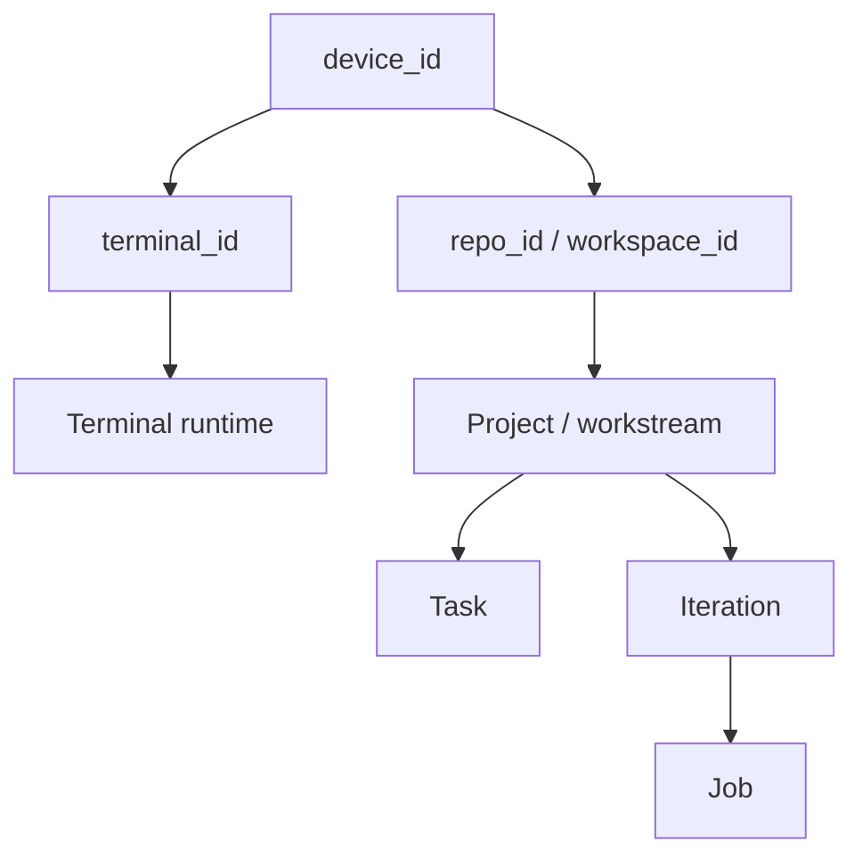
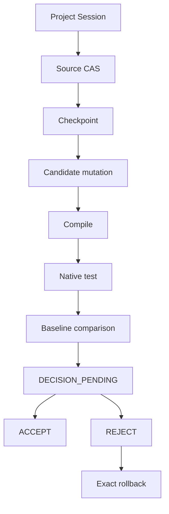
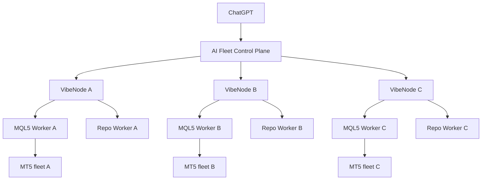
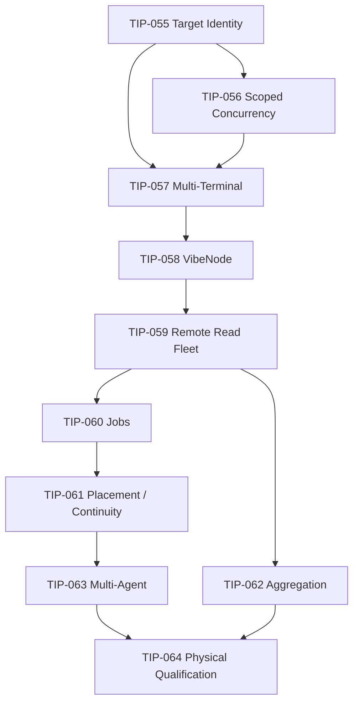

# TunnelVibemq5 → Vibe Fleet Platform

## Kế hoạch kiến trúc và lộ trình để brainstorm cùng team Astra

- **Ngày đóng gói:** 01/10/2026, múi giờ Asia/Saigon.
- **Trạng thái:** ĐỀ XUẤT — CHƯA DUYỆT TRIỂN KHAI.
- **Mục đích:** tập hợp kế hoạch đã thảo luận thành một tài liệu độc lập để phản biện, điều chỉnh phạm vi và chốt Blueprint.
- **Phạm vi trước mắt:** nhiều VPS/PC, mỗi máy có nhiều MT5; ChatGPT quản lý, truy vấn và tổng hợp thông tin qua một MCP gateway.
- **Định hướng dài hạn:** hạ tầng điều khiển AI cho nhiều máy, nhiều repo và nhiều agent, với MQL5 Worker và Repo Worker tách biệt.
- **Không phải TIP spec thực thi:** mapping file/module đầy đủ, protocol/schema, acceptance test chi tiết và regression suite sẽ được chốt sau brainstorm.

### Nguồn và mức xác nhận

Tài liệu đóng gói nội dung kế hoạch được cung cấp trong cuộc trò chuyện. Những nhận định về codebase, RemoteMCP, file/line và test hiện có được giữ theo báo cáo trước; **không có lần kiểm chứng repo hoặc runtime mới trong bước đóng gói này**. Ví dụ ID, VPS, build và số liệu chỉ minh họa kiến trúc, không phải inventory hiện tại.

Phần kế hoạch nhận được bắt đầu giữa nội dung về fixed-target assumption và có đầy đủ các mục 4–50. Mục 1–2 dưới đây tổng hợp mục tiêu và nguyên tắc từ phần ngữ cảnh đã có; không phục dựng nguyên văn phần bị lược bỏ. Mục 3 giữ các chi tiết code được cung cấp. Các mục 4–50 giữ nội dung kỹ thuật của kế hoạch. Phụ lục A–C bổ sung khung phản biện và ghi quyết định cho team Astra, được tách khỏi đề xuất gốc.

## Mục lục

1. Mục tiêu và phạm vi
2. Nguyên tắc kiến trúc
3. Fixed-target assumption và khả năng reuse
4. Concurrency hiện tại
5–15. Identity, placement, project session và job routing
16–19. Fleet read model và concurrency mở rộng
20–23. Worktree và multi-agent
24–29. Control plane, authority, node và tool surface
30–37. Use case, failure semantics và kiến trúc dài hạn
38–40. TIP-055 → TIP-064 và dependency
41–43. Port/reuse và non-regression contract
44–50. Migration, pilot, Blueprint và bước đầu tiên
A. Các điểm cần team Astra phản biện
B. Khung ghi quyết định
C. Prompt bàn giao cho team Astra

---

## 1. Mục tiêu và phạm vi

TunnelVibemq5 cần kết nối và quản lý nhiều VPS/PC. Mỗi máy có thể có nhiều MT5 runtime độc lập. ChatGPT đóng vai trò operator/orchestration: chọn target, lấy dữ liệu, tổng hợp tình trạng, yêu cầu compile/test và đọc evidence qua MCP.

Mục tiêu đầu tiên là **Multi-VPS VibeMQL5**. Mục tiêu tiếp theo mới là một Fleet Platform có thể vận hành nhiều repo và nhiều agent với các capability provider riêng.

Các nhu cầu chính:

- Kiểm tra sức khỏe toàn bộ VPS và MT5.
- Tìm terminal mất kết nối, build drift hoặc trạng thái tài khoản bất thường.
- Tổng hợp balance/equity và các dữ liệu tài khoản cần thiết.
- Lấy chart, quotes, rates, ticks theo đúng VPS và terminal.
- Compile/test EA trên target được chỉ định và đối chiếu evidence.
- Chạy compatibility matrix qua nhiều terminal/build.
- Về sau: nhiều agent làm việc trên nhiều repo hoặc worktree độc lập.

Đề xuất cuối của kế hoạch nghiêng về **một Fleet control plane thống nhất**, thay vì để ChatGPT tự điều phối RemoteMCP và TunnelVibemq5 như hai control plane song song. RemoteMCP là nguồn tham khảo primitive; core MT5 hiện tại tiếp tục là execution authority cho MQL5.

## 2. Nguyên tắc kiến trúc

1. Reuse core và invariant hiện tại; không rewrite compile/tester/provenance.
2. Identity tách khỏi alias và build; job bind vào đúng device + terminal.
3. Placement bất biến sau khi commit target; không silent migration/fallback.
4. Node kết nối outbound-only; một MCP catalog cho toàn fleet.
5. Fleet reads chấp nhận partial result; mutation và native job phải fail closed theo target.
6. Central registry quản lý control-plane state; node xác nhận runtime thực tế.
7. Giữ project session, guarded iteration, checkpoint/CAS và Continuity.
8. Mở capability từng bước: read-only trước, native jobs sau, mutation/multi-agent sau nữa.
9. SQLite WAL và một gateway authority là đề xuất khởi đầu; chưa cần distributed DB, message broker hoặc Kubernetes.
10. Mỗi TIP có phạm vi và bằng chứng riêng trước khi mở capability tiếp theo.

Trước khi viết code cho mỗi thay đổi, trả lời:

- Cái này có cần tồn tại không?
- Có thứ gì sẵn trong codebase/thư viện dùng được không?
- Nếu buộc phải viết, cách ngắn nhất là gì?

## 3. Fixed-target assumption và khả năng reuse

Theo báo cáo trước, MCP adapter vẫn hard-code target:

```python
facade.compile_ea(..., terminal="MT5-2")
facade.launch_test(..., terminal="MT5-2")
```

Worker cũng lấy fixed target:

```text
fixed_alias
effective_alias = fixed_alias
```

Compiler/tester driver đã parameterized theo terminal. Inventory đã quản lý nhiều installation. Result đã có requested/effective terminal. Vì vậy phần abstraction MT5 có thể reuse đáng kể.

Việc đầu tiên là **bỏ fixed-target assumption khỏi orchestration nhưng giữ toàn bộ invariant hiện tại**. Chưa cần bắt đầu bằng triển khai multi-VPS node.

## 4. Concurrency hiện tại là bottleneck có chủ đích

Theo báo cáo, `app/vibemql5/core/concurrency.py:517-527` công bố:

```text
mode                        MULTI_CLIENT_SERIALIZED
source_mutation_parallelism  1
native_mt5_parallelism       1
```

Native lock hiện là `runs/.active.lock`, áp dụng toàn VPS. MT5-2 đang chạy tester thì MT5-3, dù độc lập, vẫn phải chờ. TIP-024 tests còn cố ý chứng minh FIFO toàn cục.

Với fleet, đề xuất đổi phạm vi serialization:

```text
native/VPS08/MT5-1.lock
native/VPS08/MT5-2.lock
native/VPS08/MT5-3.lock
```

Hoặc node-local theo stable ID:

```text
state/concurrency/native/<terminal_id>.lock
```

Mỗi terminal vẫn serialize nội bộ; các terminal độc lập có thể chạy song song trong giới hạn tài nguyên device. Không bỏ serialization, chỉ đổi phạm vi.

## 5. Identity model lấy ý tưởng phù hợp từ RemoteMCP

Hierarchy đề xuất:



Mỗi VPS/PC có:

```text
device_id
device_name
public_key
route_generation
state
capabilities
platform
last_seen
```

Ví dụ:

```text
device_id = dev_vps08_a82...
device_name = VPS-08

device_id = dev_vps02_f31...
device_name = VPS-02
```

`device_id` phải bền qua reboot.

## 6. Route generation chống stale route

Ví dụ VPS-08 có `device_id=dev_A`, `route_generation=7`. Mọi command tới node bind vào cả hai giá trị.

Khi revoke, re-pair, identity replacement hoặc route reset, generation tăng thành 8. Command pin generation 7 phải fail closed.

Mục tiêu: chặn stale controller, route confusion và execution trên identity cũ. Replay protection còn cần nonce/idempotency; generation không thay thế các cơ chế đó.

## 7. Node authentication

Pattern đề xuất học từ RemoteMCP:

```text
Ed25519 node identity
+ signed request
+ timestamp
+ nonce
+ replay table
+ route_generation
```

VibeNode giữ private key tại VPS; control plane giữ public key của node.

Luồng hoạt động:

1. Fleet Gateway queue command.
2. VibeNode outbound poll để nhận command.
3. Node gửi signed heartbeat, signed polling và signed result commit.

Node không cần inbound port hoặc public tunnel riêng cho từng VPS. Protocol pairing, canonical payload ký và cách node xác thực gateway cần chốt trước khi implement.

## 8. Alias không phải terminal identity

Các tên `MT5-1`, `MT5-2`, `MT5-3`, `MT5-4`, `MT5-PROGRAM` chỉ nên là human-readable alias.

Thêm stable `terminal_id`:

```text
terminal_id = mt5_c3f7...
device_id   = dev_vps08...
alias       = MT5-2
data_hash   = 64FD23...
```

Terminal ID có thể bind với device identity, canonical installation và MT5 data-root identity. Thuật toán/persistence cụ thể chưa được chốt.

**Không đưa build number vào terminal identity.** MT5 update build 6140 → 6230 vẫn có thể là cùng terminal. Terminal identity và terminal build là hai authority khác nhau.

## 9. Terminal generation

Mỗi terminal có `terminal_generation`, tăng khi identity-sensitive configuration đổi:

- Executable path.
- Data root.
- Terminal registration replacement.
- Disabled/re-enabled với identity mới.

Không tăng chỉ vì MT5 auto-update build.

Job pin các trường:

```text
device_id
device_generation
terminal_id
terminal_generation
terminal_build_at_execution
```

Tên `device_generation` ở đây cần được thống nhất với `route_generation` trong schema cuối; kế hoạch gốc chưa xác định đây là alias hay hai khái niệm khác nhau.

## 10. Không silent terminal fallback cho pinned job

Theo báo cáo, `TerminalInventory` có logic chọn terminal idle khác khi requested installation đang chạy. Logic đó hữu ích cho pool scheduling nhưng không được dùng cho job đã bind target, ví dụ `VPS-02 / MT5-3`.

MT5-3 busy/offline thì queue hoặc block; không tự chuyển sang MT5-4.

| Mode | Semantics |
|---|---|
| `PINNED` | Chạy đúng terminal hoặc không chạy. |
| `POOL` | Scheduler chọn terminal trước execution; sau khi chọn, target trở thành immutable. |

Pool scheduling để sau pinned routing.

## 11. Project binding phải adapt, không copy nguyên RemoteMCP

RemoteMCP dùng project → device, task kế thừa device. Với MQL5 cần tách **repo placement** khỏi **execution target** vì cùng repo có thể test qua nhiều MT5 build.

| Entity | Binding đề xuất |
|---|---|
| Repo | `repo_id` → device chứa repo |
| Project/workstream | `default_execution_target` |
| Iteration | Immutable execution target |
| Job | Immutable execution target |

Ví dụ:

```text
repo EA-GOLD
    device = VPS-08

project GOLD-V3
    default target = VPS-08 / MT5-2

iteration IT-001
    target = VPS-08 / MT5-2

compatibility job
    target = VPS-08 / MT5-3
```

Mô hình giữ reproducibility và cho phép matrix testing. Cách chuyển source/input giữa repo device và execution device khác nhau là quyết định còn mở.

## 12. Giữ Project Session hiện tại

Không thay `project_session` bằng project/task semantics của RemoteMCP.

Abstraction hiện có theo báo cáo:

```text
project_id
workspace
EA
source SHA
checkpoint
baseline job
last job
phase
revision SHA
```

Mở rộng revision bằng:

```text
default_execution_target
repo_id
device_id
terminal_id
target_generation
```

Iteration kế thừa target hoặc nhận explicit override theo policy. Schema `target_generation` phải được làm rõ với cặp device/terminal generation.

## 13. Bảo tồn Guarded Iteration

Flow hiện tại tiếp tục được giữ:



Fleet architecture chủ yếu thay `_fixed_terminal()` bằng `resolve_execution_target()`. Không redesign state machine guarded iteration nếu không có bằng chứng cần thiết.

## 14. Baseline phải target-aware

Không so baseline chạy trên build 5233 với candidate chạy trên build 6230 như thể cùng môi trường.

Baseline provenance cần chứa:

```text
device_id
terminal_id
terminal_generation
terminal_build
broker/server nếu liên quan
tester configuration
EA/source SHA
```

Policy được đề xuất:

```text
STRICT_TARGET
SAME_TERMINAL
SAME_BUILD
EXPLICIT_CROSS_TARGET
```

Default fail closed. Định nghĩa chính xác mỗi policy và quan hệ giữa chúng cần chốt trong spec.

## 15. Global job routing

ChatGPT không cần nhớ job nằm trên VPS nào. Fleet Gateway giữ:

```text
global_job_id
    -> device_id
    -> terminal_id
    -> node_job_id
```

Ví dụ:

```text
FJOB-20261001-...
    device   = dev_vps02
    terminal = mt5_vps02_3
    node_job = BT-20261001-...
```

Các tool hiện có tự route theo global job:

```text
get_job(FJOB...)
cancel_job(FJOB...)
read_result(FJOB...)
read_artifact(FJOB...)
```

`cancel_job` phải giữ invariant kill exact bound PID/job; không kill hàng loạt `terminal64.exe`.

## 16. Fleet read model

Nhu cầu trực tiếp của người dùng là lấy thông tin nhiều MT5 để tổng hợp. Không bắt ChatGPT gọi thủ công hàng chục tool nếu có thể fan-out read trong một API.

Ví dụ interface tương lai, chưa phải tool đã triển khai:

```python
fleet_snapshot(
    devices="*",
    terminals="*",
    include=["health", "account", "connection", "charts"],
)
```

Control plane fan-out tới các target và trả normalized data:

```text
target
online
build
login
server
balance
equity
free_margin
ping
trade_state
charts
errors
observed_at
```

ChatGPT dùng dữ liệu để tổng hợp tài khoản, tìm terminal disconnect, so equity/balance, tìm VPS degraded, kiểm tra chart/symbol mở, phát hiện build drift hoặc account bất thường.

## 17. Fleet fan-out hỗ trợ partial result

Một terminal offline không làm toàn bộ snapshot thành error.

Ví dụ:

```text
status  = PARTIAL
success = 19
failed  = 1

failures:
    VPS03/MT5-4:
        DEVICE_OFFLINE
```

Fleet reads cho phép partial aggregation. Mutation/native jobs vẫn yêu cầu exact-target correctness và fail closed.

## 18. Multi-terminal concurrency

Mô hình khóa:

| Scope | Primitive |
|---|---|
| MT5-1 | Native mutex riêng |
| MT5-2 | Native mutex riêng |
| MT5-3 | Native mutex riêng |
| Repo A | Mutation lease riêng ở giai đoạn sau |
| Repo B | Mutation lease riêng ở giai đoạn sau |

Không suy ra có 5 terminal là được chạy 5 Strategy Tester đồng thời. Cần hai giới hạn:

```text
terminal native parallelism = 1
device native capacity = configurable resource budget
```

Ví dụ VPS08 có 5 MT5 nhưng `max_native_jobs=2`: scheduler chỉ cho tối đa hai native workloads đồng thời. ResourceGuard vẫn quyết định cuối cùng.

## 19. Source mutation parallelism

Global mutation lock hiện tại được giữ ở bước mở native concurrency. Về sau chuyển dần sang repo/workspace scope.

- EA-GOLD đang mutate thì EA-SILVER có thể mutate độc lập.
- Hai mutation trên cùng nguồn EA-GOLD vẫn phải serialize/CAS.

Roadmap:

1. Global mutation lock.
2. Repo-scoped lock.
3. Task/worktree isolation.
4. Path leases nếu thực sự cần.

Không port FILE/TREE lease ngay lập tức.

## 20. Git worktree — lấy sau Fleet

Khi nhiều AI agent build cùng repo, mỗi task có worktree riêng thay vì cùng sửa một checkout.

```text
.vibe-worktrees/
    repo_001/
        task_A/
        task_B/
        task_C/
```

Mỗi task giữ:

```text
base commit
branch
worktree root
agent owner
lease epoch
```

EA compilation của task phải dùng source trong worktree của task đó.

## 21. Worktree không thay Project Session

| Abstraction | Trách nhiệm |
|---|---|
| Worktree | Isolation vật lý của source |
| Project Session | Lịch sử semantic của EA |
| Iteration | Candidate mutation và evidence lifecycle |

Các lớp kết hợp: repo → task/worktree → project/workstream → iteration → compile/test/evidence.

## 22. Multi-agent — reuse Continuity delegation

Continuity hiện đã hỗ trợ typed delegation theo báo cáo:

```text
DELEGATION_ASSIGNED
DELEGATION_STARTED
DELEGATION_COMPLETED
DELEGATION_PARENT_VERIFIED
DELEGATION_CANCELLED
```

Tests đã bao phủ idempotent delegation, illegal transition rejection, spoof rejection, nested delegation và parent verification.

Không port một delegation system khác để thay Continuity. Phần còn thiếu là ownership/concurrency:

```text
agent_id
session_id
task_id
lease_epoch
lease_token
```

Continuity là semantic/event authority; task lease chỉ phối hợp execution.

## 23. Agent model đề xuất

Agent:

```text
agent_id
session_id
capabilities
last_heartbeat
```

Task:

```text
task_id
repo_id
project_id
owner_agent_id
lease_epoch
lease_expires_at
state
```

State tối thiểu:

```text
READY
CLAIMED
RUNNING
BLOCKED
RECOVERABLE
COMPLETED
```

Agent mất heartbeat thì task chuyển `RECOVERABLE`; **native job đang chạy không bị kill tự động**. Agent ownership và process ownership phải tách biệt.

## 24. Device Control Plane

Central registry chỉ chứa control-plane state:

```text
devices
terminals
repos
bindings
agents
tasks
leases
operations
routed_commands
job_routes
```

Đề xuất giai đoạn đầu: **SQLite WAL**, một gateway authority. Chưa dùng Redis, PostgreSQL cluster, message broker hoặc Kubernetes.

Đây là đề xuất YAGNI, chưa phải quyết định Blueprint đã duyệt.

## 25. Authority split

| Authority | Dữ liệu và hành vi chịu trách nhiệm |
|---|---|
| Fleet Control Plane | Device identity; terminal registration; route generation; repo/device placement; task leases; command routing; global job map. |
| VibeNode | Filesystem thực tế; MT5 runtime; terminal process; compile; tester; live data; local job artifacts. |
| Existing VibeMQL5 provenance | Source SHA; checkpoint; build inputs; runtime evidence; result; artifacts; iteration; continuity. |

Không để central DB trở thành bản copy có vẻ đúng của runtime. Read model phải có nguồn và thời điểm quan sát để phân biệt registry/cache với evidence thực tế.

## 26. VibeNode reuse ToolFacade

Không implement lại compile, tester, live chart, market data, workspace, binary ingress hoặc runtime capture.

Node chỉ thêm các nhiệm vụ cần thiết:

```text
identity
heartbeat
poll
routing validation
command journal
dispatch
result commit
```

Dispatch: command → resolve target terminal → existing ToolFacade/core → existing artifact/evidence pipeline.

## 27. Một tool surface cho toàn fleet

Không tạo `vps1_compile_ea`, `vps2_compile_ea`, `vps3_compile_ea`; không nhân catalog 85 tool theo số VPS.

Một catalog domain tool, thêm `target` hoặc infer từ project binding:

```python
compile_ea(workspace, ea, target="dev_vps02/mt5_3")

launch_test_v2(..., operation_id=..., target="dev_vps02/mt5_3")
```

Backward-compatible path:

```text
target omitted -> legacy local / MT5-2 policy
```

Giữ đường legacy tới khi migration hoàn tất. Target syntax và quy tắc infer còn cần schema chính thức.

## 28. Giữ ít tool mới

Control-plane primitives dự kiến:

```text
fleet_list_devices
fleet_device_status
fleet_list_terminals
fleet_terminal_status
fleet_snapshot
device_pair_begin
device_revoke
project_bind_target
```

Domain operations reuse tool hiện tại; không thêm hàng chục fleet wrappers. Danh sách này là dự kiến, chưa khẳng định đã đủ cho lifecycle enrollment/rotation.

## 29. Read-only target-aware trước mutation

Thứ tự mở capability:

1. Inventory.
2. Health.
3. Live/account state.
4. Charts.
5. Market data.
6. Compile.
7. Tester.
8. Source mutation.
9. Multi-agent.

Mục đích: chứng minh physical routing trước khi mở các thao tác có tác động lớn hơn.

## 30. Use case: trạng thái toàn hệ thống

Người dùng: “Kiểm tra toàn bộ VPS và MT5, terminal nào mất kết nối, balance/equity hiện tại thế nào?”

ChatGPT gọi `fleet_snapshot()`. Gateway fan-out rồi ChatGPT tổng hợp:

| VPS | MT5 | State | Build | Server | Balance | Equity | Ping |
|---|---|---|---:|---|---:|---:|---:|
| VPS08 | MT5-2 | ONLINE | 6230 | Broker A | … | … | … |
| VPS08 | MT5-3 | ONLINE | 5233 | Broker B | … | … | … |
| VPS02 | MT5-1 | OFFLINE | — | — | — | — | — |
| VPS03 | MT5-2 | ONLINE | … | … | … | … | … |

Bảng là minh họa output, không phải snapshot thật.

## 31. Use case: test đúng physical machine

Người dùng: “Test EA GOLD trên VPS02 MT5-3.”

Luồng:

1. Resolve target thành stable device/terminal IDs.
2. Validate generations.
3. Bind global `operation_id` và queue command.
4. VibeNode VPS02 poll command.
5. Acquire terminal-scoped native lease và kiểm tra device capacity.
6. Chạy compile/test pipeline hiện tại.
7. Commit result và target provenance.
8. Fleet Gateway trả kết quả cho ChatGPT.

Result cần ghi:

```text
device_id
device_generation
hostname
terminal_id
terminal_alias
terminal_generation
terminal_build_at_execution
node_runtime_version
tool_catalog_sha256
```

## 32. Use case: cùng EA trên nhiều MT5

Compatibility matrix gồm ba job độc lập:

| EA | Target | Build minh họa |
|---|---|---:|
| GOLD | VPS08 / MT5-2 | 6230 |
| GOLD | VPS08 / MT5-3 | 5233 |
| GOLD | VPS02 / MT5-1 | 5464 |

Không terminal fallback. ChatGPT tổng hợp compile status, tester status, fatal diagnostics, metrics và behavior differences. Cross-target comparison phải dùng policy explicit, không giả định tương đương môi trường.

## 33. Failure semantics

| Sự kiện | Hành vi đề xuất |
|---|---|
| Device offline | Pinned task/job trả `DEVICE_OFFLINE`; không migrate. |
| Terminal busy | Queue hoặc `TERMINAL_BUSY`; không đổi terminal pinned. |
| Device reconnect | Cùng identity/key/generation thì tiếp tục theo journal/job identity. |
| Re-pair/revoke | Generation đổi; stale command fail closed. |
| Control-plane restart | Persist command/job registry; node reconnect; idempotency ngăn duplicate execution. |

## 34. Không failover native process theo nghĩa truyền thống

VPS-A chết không thể chuyển process MT5 đang chạy sang VPS-B như thể tiếp tục cùng execution: account, build, data, deployment, tester cache và evidence có thể khác nhau.

Failover chỉ hợp lệ trước execution khi task còn unbound/pool. Sau target commit, placement immutable. Một lần chạy mới trên target khác phải có identity/evidence riêng; không giả dạng continuation của native process cũ.

## 35. Control plane hỗ trợ nhiều repo

Ví dụ:

| Device | Repo |
|---|---|
| A | EA-GOLD, EA-XAU, research-A |
| B | EA-BTC, research-B |

Control plane giữ `repo_id -> device_id -> local root`. ChatGPT sử dụng ID như `repo_xau`, không cần nhớ đường dẫn Windows kiểu `C:\VibeMQL5\workspace\BD\...`.

## 36. Generic repo tooling để sau MT5 Fleet

Phase đầu không thêm generic shell, generic file explorer, npm, pip, docker hoặc arbitrary process runner vào MT5 authority.

Thứ tự:

1. Multi-VPS VibeMQL5.
2. Generic Repo Worker capability dưới dạng module riêng sau khi MT5 fleet ổn định.

## 37. Kiến trúc dài hạn



MQL5 Worker dùng core hiện tại. Repo Worker về sau cung cấp Git, worktree, generic test/build và limited command execution. Control plane không cần biết chi tiết execution của từng domain.

## 38. TIP Task Graph đề xuất

### TIP-055 — Target Identity Foundation

**Mục tiêu:** stable terminal ID, execution target model và target provenance.

**Reuse:** `TerminalInventory`, `TerminalInfo`, existing result environment; compiler/tester đã parameterized.

**Phạm vi:** terminal pinning/provenance và bỏ fixed-MT5 assumption khỏi internal orchestration. Vẫn một device, native parallelism = 1.

**Acceptance:**

- MT5-2 và MT5-3 có ID khác nhau.
- Build update không đổi `terminal_id`.
- Target mismatch fail closed.
- Legacy MT5-2 behavior không đổi.

### TIP-056 — Terminal-Scoped Native Concurrency

**Dependency:** TIP-055.

**Thay đổi:** thay global `runs/.active.lock` bằng scoped native lease, có device capacity limit. Global mutation lock giữ nguyên.

**Acceptance:**

- Hai job cùng terminal → FIFO.
- Hai terminal khác nhau → có thể chạy song song.
- Enforce device `max_native_jobs`.
- Dead-lock/lease recovery hiện có vẫn hoạt động; semantics cần định nghĩa chính xác trong spec.

### TIP-057 — Local Multi-Terminal Routing

**Dependency:** TIP-055 và TIP-056.

**Parameterize:** live state, account snapshot, charts, market data, compile, launch test.

**Thay đổi:** loại fixed MT5-2 khỏi routed path; giữ legacy default.

**Acceptance:**

- Requested terminal = executed terminal.
- Result provenance khớp.
- Không silent fallback.
- Cancel chỉ exact target process.

### TIP-058 — Device Identity + VibeNode

**Dependency:** TIP-057.

**Thêm:** stable device ID, Ed25519, pairing, heartbeat, nonce, route generation, revoke và outbound node.

**Acceptance:**

- Hai VPS có distinct IDs.
- Reboot giữ identity.
- Replay rejected.
- Stale generation rejected.
- Revoke fail closed.

### TIP-059 — Remote Read-Only Fleet

**Dependency:** TIP-058.

**Route:** health, terminal inventory, account state, charts, quotes/rates/ticks.

**Acceptance:**

- VPS08 data không thể xuất hiện dưới VPS02.
- Offline node trả scoped failure.
- Fleet snapshot hỗ trợ partial results.

Đây là first physical multi-VPS gate. Phần snapshot tối thiểu ở TIP này cần phân biệt với aggregation đầy đủ ở TIP-062.

### TIP-060 — Remote Native Job Routing

**Dependency:** TIP-059.

**Route:** compile, launch test, get job, cancel job, result, diagnostics và artifacts. Thêm global job proxy.

**Acceptance:**

- Job chạy đúng VPS + terminal.
- Duplicate `operation_id` → một native job.
- Gateway restart không tạo duplicate job.
- Node reconnect giữ job identity.
- Cancel kills exact bound process.

### TIP-061 — Project/Repo Placement + Continuity Integration

**Dependency:** TIP-060.

**Thêm:** repo ID, device binding, project default target, iteration pinned target và target-aware baseline. Continuity ghi target evidence.

**Acceptance:**

- Resume project không đổi target âm thầm.
- Target drift → `resume_safe=false`.
- Baseline sai target/build → fail closed theo policy.

### TIP-062 — Fleet Aggregation

**Dependency:** TIP-059; có thể phát triển song song TIP-060/061 sau khi nền tảng read fleet đạt gate.

**Thêm:** `fleet_snapshot`, fleet status aggregation, filter/tag system và partial-result semantics.

Đây là capability phục vụ trực tiếp ChatGPT quản lý/tổng hợp toàn hệ thống. Acceptance chi tiết về freshness, coverage và aggregation cần bổ sung khi chốt TIP spec; kế hoạch gốc chưa liệt kê riêng.

### TIP-063 — Multi-Agent Task Isolation

**Dependency:** TIP-061.

**Port có chọn lọc:** agent/session, task lease, lease epoch, Git worktree và non-Git path lease. Không thay Continuity delegation.

**Acceptance:**

- Hai agent không sửa cùng checkout.
- Stale agent không commit source.
- Dead agent → task `RECOVERABLE`.
- Running native job không bị kill tự động.

### TIP-064 — Fleet Failure/Recovery Qualification

**Dependency:** tất cả các TIP trên.

Physical matrix tối thiểu:

- 3 VPS.
- Ít nhất 2 MT5/VPS.
- Simultaneous jobs.
- Gateway restart.
- Node restart.
- Terminal restart.
- Device offline.
- Reconnect.
- Revoke.
- Stale generation.
- Duplicate command.
- Job replay.
- CAS conflict.
- 60-minute soak.

Chỉ sau TIP này và bằng chứng PASS mới gọi multi-VPS production-ready. Giới hạn tải và tiêu chí PASS của soak cần được chốt, không suy ra từ thời lượng đơn thuần.

## 39. Dependency graph



Các dependency trước TIP-063 đi vào TIP-064 theo đường bắc cầu; TIP-062 có cạnh riêng để thể hiện qualification cần aggregation hoàn tất.

## 40. Không bắt đầu từ multi-agent

Trước tiên chứng minh ChatGPT → đúng VPS → đúng MT5. Worktree/task lease không giải quyết routing sai target.

Ưu tiên: target identity → routing → recovery → aggregation → multi-agent.

## 41. Những primitive nên port từ RemoteMCP

| RemoteMCP primitive | Tunnel adaptation |
|---|---|
| `device_id` | VPS/PC identity |
| Ed25519 node | VibeNode identity |
| `route_generation` | Stale-route protection |
| Outbound node | VPS không cần public inbound port |
| Project → device | Repo → device |
| Immutable task placement | Iteration/job → target |
| Operation idempotency | Reuse Tunnel operation IDs |
| Routed job proxy | Global Fleet job |
| Task lease | Agent ownership |
| Git worktree | Parallel-agent source isolation |
| FILE/TREE lease | Non-Git workspace isolation nếu cần |
| No silent migration | Exact VPS/MT5 execution |

Port có chọn lọc theo semantics, không mặc định copy implementation.

## 42. Những phần không nên port

- Generic command layer làm execution authority chính.
- Legacy `run_command` pattern.
- Generic workspace abstraction thay Vibe workspace.
- RemoteMCP project semantics thay `project_session`.
- RemoteMCP journal thay Continuity.
- RemoteMCP CAS thay Tunnel checkpoint + CAS.

Tunnel đã có domain implementation phù hợp cho các phần này theo đánh giá trước.

## 43. Non-regression contract

Multi-VPS không được làm yếu các invariant/capability hiện có:

- Checkpoint trước mutation trên existing source.
- Exact expected SHA.
- Atomic restore.
- Operation idempotency.
- Job process ownership.
- Exact cancellation.
- Build-input provenance.
- Terminal build authority.
- Binary ingress receipts.
- Structured compiler diagnostics.
- Structured tester events.
- Hash-bound artifacts.
- Runtime capture.
- Baseline comparison.
- Project session.
- Guarded iteration.
- Continuity chain.
- Delegation lifecycle.
- Supervisor/watchdog.
- Current-runtime certification.

Đây là contract cần mapping sang regression evidence thực tế khi viết TIP spec; danh sách không tự chứng minh các gate đã PASS.

## 44. Migration strategy

| Giai đoạn | Execution mode | Điều kiện đề xuất |
|---|---|---|
| Hiện tại / legacy | `FIXED` | MT5-2 policy hiện có |
| Sau TIP-057 | `LOCAL_ROUTED` | Local routing và concurrency gates PASS |
| Sau TIP-060 | `FLEET_ROUTED` | Remote native routing gates PASS |

Giữ legacy release `FIXED / MT5-2` cho tới khi physical gates PASS. Không bật Fleet mode toàn hệ thống ngay từ đầu.

## 45. Initial Fleet pilot

Pilot đề xuất:

| Vai trò | Device | Terminals |
|---|---|---|
| Gateway | Current VPS-08 | Gateway authority |
| Node A | VPS-08 | MT5-2, MT5-3 |
| Node B | VPS mới | MT5-1, MT5-2 |

Hai devices, bốn terminals đủ cho pilot kiểm tra same-device multi-terminal, cross-device routing, concurrency, target provenance, offline/reconnect và aggregation.

Pilot này không thay physical qualification của TIP-064: qualification cuối vẫn yêu cầu ba VPS, mỗi VPS ít nhất hai MT5.

## 46. Hình thái người dùng sẽ thấy

Các yêu cầu tự nhiên dự kiến:

- “Kiểm tra tất cả VPS.”
- “MT5 nào đang disconnect?”
- “Tổng hợp equity của toàn bộ tài khoản.”
- “Chụp chart XAUUSD M5 của VPS03/MT5-2.”
- “Chạy EA X trên MT5 build mới nhất ở VPS02.”
- “So sánh EA này trên build 5233, 5464 và 6230.”
- “Agent A sửa EA Gold, Agent B sửa EA BTC, test song song.”
- “Cho tôi toàn bộ job lỗi trên fleet trong 24 giờ.”

ChatGPT là orchestration/operator layer; VibeMQL5 Fleet là execution/evidence layer.

## 47. Hướng generic AI infrastructure

Không biến `vibemql5.core` thành generic core. Tiến hóa thành:

```text
Vibe Fleet Platform
    MQL5 capability provider
    Repo capability provider
```

MQL5 capability provider chính là TunnelVibemq5 hiện tại. Fleet MCP Gateway quản lý device orchestration, agent/task orchestration, routing, aggregation và liên kết Continuity; capability worker giữ execution semantics của domain.

Boundary giữa Gateway và existing Continuity authority cần chốt để không tạo hai event authority cạnh tranh.

## 48. Blueprint checkpoint

Các quyết định khuyến nghị khóa trước khi build; hiện đều là đề xuất:

| Decision | Đề xuất |
|---|---|
| Một MCP gateway cho toàn fleet | YES |
| Node kết nối outbound-only | YES |
| Current VPS-08 làm gateway pilot | YES |
| `device_id` cryptographic/stable | YES |
| Stable `terminal_id` tách alias/build | YES |
| Job pin VPS + terminal | YES |
| Silent failover | NO |
| Terminal pool scheduling | Sau pinned routing |
| Global native lock | Chuyển terminal-scoped |
| Global source lock | Giữ trước, repo-scoped sau |
| Worktree/multi-agent | Sau Fleet routing |
| Generic Repo Worker | Sau MT5 Fleet |
| Central distributed DB | NO; SQLite WAL trước |
| Message broker | NO |
| Kubernetes | NO |

## 49. Recommendation và bước đầu tiên sau khi duyệt

Bắt đầu bằng **TIP-055**, không phải multi-VPS node hoặc multi-agent.

TIP-055 chỉ làm ba việc:

1. Stable target identity.
2. Terminal pinning/provenance.
3. Bỏ fixed-MT5 assumption khỏi internal orchestration.

Vẫn giữ `native_mt5_parallelism=1`, `device count=1`. Khi chứng minh backward compatibility mới chuyển sang TIP-056 scoped concurrency.

Sau khi Blueprint được duyệt, chuyển TIP-055 → TIP-064 thành spec thực thi có mapping file/module hiện có, acceptance tests, regression gates, dependency và evidence cần thu thập. **Lượt đóng gói này chưa bắt đầu update repo.**

Điểm reuse ưu tiên: driver compiler/tester đã parameterized; inventory có multi-installation; result đã lưu requested/effective terminal; TIP-024 có FIFO lease/recovery. Phần mở rộng chính là identity, fixed policy và lock scope.

## 50. Target cuối

Tunnel tiến từ MT5 automation bridge thành **AI Runtime Fabric**:

- ChatGPT vận hành qua Fleet control plane.
- Nhiều device chạy nhiều capability worker.
- Worker quản lý nhiều MT5 hoặc repo.
- Durable evidence, Continuity và guarded execution nối toàn luồng.

Giá trị riêng của Tunnel tiếp tục được giữ: MT5-native authority, compile/tester semantics, runtime evidence, baseline, checkpoint, guarded iteration và domain-specific provenance.

Đây là đích kiến trúc đề xuất, chưa phải capability đã triển khai hoặc qualification đã đạt.

---

## Phụ lục A — Các điểm cần team Astra phản biện

Phần này bổ sung để phục vụ brainstorm; không tự chốt thêm kiến trúc.

### A1. Naming và identity

- `route_generation`, `device_generation`, `target_generation` là alias hay các epoch khác nhau? Chọn schema thống nhất và xác định authority tăng từng epoch.
- Stable `terminal_id` được cấp và persist như thế nào? Canonical path/data-root là thuộc tính binding hay thành phần ID? Path đổi thì giữ ID và tăng generation hay tạo ID mới?
- Re-pair giữ device ID hay tạo identity mới? Key rotation có khác identity replacement không?
- `hostname` chỉ là provenance; device ID phải tiếp tục là authority dù rename máy.
- Làm sao phát hiện hai VPS được clone từ cùng image/private key và tránh hai node cùng nhận một identity?

### A2. Authentication và pairing

- Node xác thực gateway/command bằng cơ chế nào? Signed node requests chưa tự giải quyết command authenticity.
- Pairing bootstrap, approval/ownership, token expiry và key rotation/recovery có contract nào?
- Canonical signed payload gồm method/path/body hash, generation, timestamp và nonce ra sao?
- Clock skew, nonce retention và replay table sau restart được xử lý thế nào?
- Revocation có hiệu lực ở dispatch, trước native start và result commit ra sao? Native job đã chạy thì semantics là gì?

### A3. Command lifecycle, journal và idempotency

- State machine command tối thiểu là gì: queue, delivery, acknowledgement, execution, result commit và unknown outcome?
- Dispatch/ack/start crash windows được reconcile thế nào để không duplicate native job?
- `operation_id` có scope toàn fleet hay theo project/device? Cùng ID nhưng khác target hoặc payload phải trả lỗi gì?
- Journal node và gateway cần giữ bao lâu? Restart/restore backup có thể làm idempotency hoặc generation lùi không?
- Cách phân biệt agent mất heartbeat với node mất kết nối và native process đã chết?

### A4. Concurrency và process authority

- Terminal native lease áp dụng cho compile, tester, chart capture và live reads ra sao? Những thao tác nào được đồng thời trên cùng terminal?
- Thứ tự acquire terminal lock/device capacity/repo lock là gì để tránh deadlock và starvation?
- Device capacity được cấu hình cố định hay cập nhật theo CPU/RAM? ResourceGuard veto khi nào?
- Một terminal đang live trading và một tester dùng cùng installation/data-root có được xem là độc lập không?
- Exact cancellation phải chống PID reuse bằng bằng chứng process ownership nào?

### A5. Repo placement và build inputs

- Repo ở VPS-A nhưng execution target ở VPS-B: transfer source, include, preset, binary và build inputs qua protocol nào?
- Input bundle pin những hash nào; node verify trước compile/test ra sao?
- Artifact routing/download giữ hash-bound receipts và nguồn node như thế nào khi gateway reconnect?
- Local workspace mapping nào được phép; tránh suy luận path từ tên repo như thế nào?
- Source mutation mở ở TIP nào? TIP-061 có placement nhưng chưa mô tả đầy đủ remote guarded-write transport.

### A6. Read aggregation và tính đúng của dữ liệu

- Snapshot là dữ liệu live, cache hay hỗn hợp? Freshness/TTL, `observed_at`, timeout và stale status cần hiển thị thế nào?
- TIP-059 cung cấp snapshot tối thiểu tới đâu; TIP-062 thêm gì để tránh overlap phạm vi?
- Nhiều MT5 cùng login/server có làm tổng equity bị đếm trùng không? Account identity và deduplication cần chốt.
- Tổng tiền khác currency được báo theo từng currency hay quy đổi? Nếu quy đổi thì nguồn/time của tỷ giá phải explicit.
- Filter/tag và bounded fan-out/pagination giới hạn ra sao khi fleet lớn?
- Capture chart ImageContent/resource_link/export có giữ viewer và download semantics hiện tại qua gateway không?

### A7. Baseline, resume và Continuity

- Định nghĩa `STRICT_TARGET`, `SAME_TERMINAL`, `SAME_BUILD`, `EXPLICIT_CROSS_TARGET` và thứ tự kiểm tra.
- Build auto-update không đổi ID nhưng baseline có thể mất tính tương đương: phát hiện và báo drift ở đâu?
- Broker/server, history dataset, tester model, spread và configuration nào cần pin theo use case?
- Continuity lưu ở node, project owner hay gateway? Đâu là event authority duy nhất?
- Resume khi node offline, target revoked hoặc artifact unavailable có những status nào ngoài `resume_safe=false`?

### A8. Phạm vi pilot và qualification

- Có nên tách delivery MVP read-only fleet khỏi toàn bộ TIP-055 → TIP-064 để sớm kiểm chứng nhu cầu?
- TIP-055 vừa thêm identity vừa bỏ fixed assumption: ranh giới chính xác với TIP-057 là gì?
- TIP-063 có cần non-Git path lease ngay không, hay để sau khi worktree đã chứng minh nhu cầu?
- Gateway ở VPS-08 có failure domain nào khi vừa quản lý vừa chạy native workload?
- Backup/restore SQLite và node journals được qualification bằng scenario nào?
- Tiêu chí PASS/FAIL cho 60-minute soak, latency, memory, queue fairness và recovery time là gì?
- Toàn bộ non-regression contract được map tới test/evidence nào; chỗ nào hiện chỉ có nhận định?

## Phụ lục B — Khung ghi quyết định sau brainstorm

Không coi một khuyến nghị là đã duyệt nếu chưa có decision record.

| ID | Chủ đề | Khuyến nghị hiện tại | Quyết định của Sếp/team Astra | Evidence/lý do | TIP ảnh hưởng |
|---|---|---|---|---|---|
| D-01 | Control plane | Một gateway authority | Chưa chốt | — | 058–064 |
| D-02 | Device identity | Stable cryptographic identity | Chưa chốt | — | 058 |
| D-03 | Generations | Route + terminal fencing | Chưa chốt schema | — | 055, 058–061 |
| D-04 | Target placement | Immutable sau target commit | Chưa chốt | — | 055–061 |
| D-05 | Native concurrency | Terminal scope + device budget | Chưa chốt | — | 056 |
| D-06 | Repo/execution split | Repo placement tách execution target | Chưa chốt transfer contract | — | 060–061 |
| D-07 | Baseline policy | Target-aware, default fail closed | Chưa chốt semantics | — | 061 |
| D-08 | Aggregation | Partial results + freshness | Chưa chốt schema | — | 059, 062 |
| D-09 | Persistence | SQLite WAL trước | Chưa chốt backup/recovery | — | 058–064 |
| D-10 | Multi-agent | Sau fleet; reuse Continuity | Chưa chốt | — | 063 |
| D-11 | Pilot | 2 devices / 4 terminals | Chưa chốt hạ tầng | — | 059–062 |
| D-12 | Qualification | 3 VPS, ≥2 MT5/VPS, fault matrix + soak | Chưa chốt PASS thresholds | — | 064 |

## Phụ lục C — Prompt bàn giao cho team Astra

> Hãy brainstorm và phản biện tài liệu TunnelVibemq5-Fleet-Plan-Astra-Brainstorm.md trước khi chúng tôi quyết định triển khai. Đây là đề xuất chưa duyệt, không phải yêu cầu bắt đầu code.
>
> Mục tiêu trước mắt: một ChatGPT MCP gateway quản lý nhiều VPS/PC, mỗi máy nhiều MT5; lấy dữ liệu đúng target, tổng hợp fleet, sau đó compile/test trên target pin. Mục tiêu dài hạn: Fleet Platform cho nhiều repo và agent với MQL5 Worker/Repo Worker riêng.
>
> Giữ checkpoint/CAS, exact rollback, operation idempotency, exact process cancellation, provenance, project session, guarded iteration và Continuity. Không rewrite core chỉ để giống RemoteMCP.
>
> Hãy trả lời: (1) điểm mạnh và chỗ reuse thực sự; (2) giả định chưa có bằng chứng; (3) mâu thuẫn identity/generation/authority; (4) failure và crash windows còn thiếu; (5) phần thừa có thể hoãn theo YAGNI; (6) phạm vi MVP và dependency TIP cần điều chỉnh; (7) acceptance/regression evidence tối thiểu; (8) quyết định cần Sếp chốt trước code.
>
> Phân biệt dữ kiện đã kiểm chứng, nhận định được kế thừa từ báo cáo và đề xuất mới. Nếu chưa đọc repo, không xác nhận file/line hoặc test là đúng. Với mỗi đề xuất thêm, nêu vì sao cần tồn tại, có gì sẵn để reuse và cách triển khai ngắn nhất. Kết quả mong muốn là Blueprint đã chỉnh cùng decision log; chưa triển khai code.

---

**Điểm dừng hiện tại:** đóng gói plan để brainstorm. Chưa duyệt Blueprint, chưa viết TIP spec thực thi, chưa thay đổi repo/runtime, chưa mở Fleet mode.
